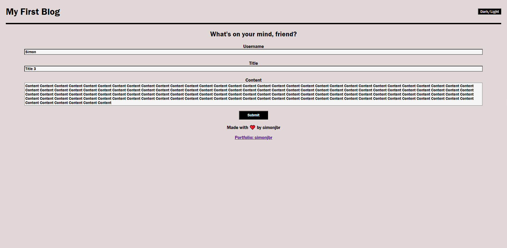
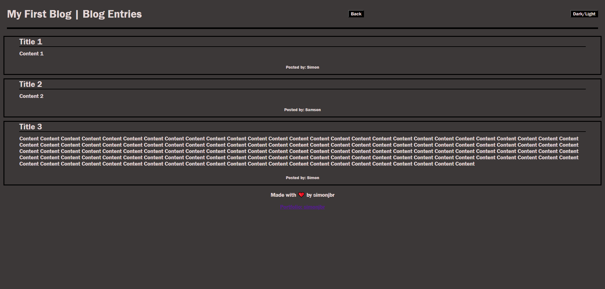

# personal-blog

## Description

The personal-blog is a web application that enables the user to create, store and display blog entries online.

## Usage

The personal-blog is made up of two pages: the landing page and the blog entries page.

The landing page is where the user can input the username, title and content of a blog via a form. Simply fill out all fields and click submit.

The blog entries page is where the user can view their new blog as well as all previously uploaded blogs. The user will also find a back button in the header. The back button will allow the user to return to the landing page and submit another blog.

Both pages provide the option to switch between a light and dark theme by clicking the "Dark/Light" button in the header.

>Deployment can be found here:
[https://simonjbr.github.io/personal-blog/](https://simonjbr.github.io/personal-blog/)

Screenshots of deployed webpage:

## Credits

simonjbr

## License

Please refer to license information in the repository